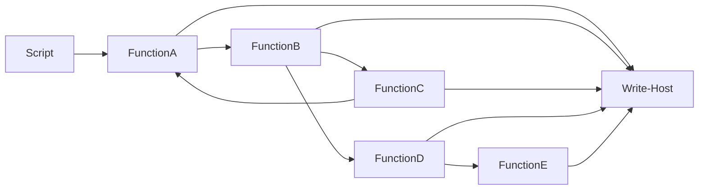

```mermaid
flowchart LR
    FunctionA[FunctionA]
    FunctionB[FunctionB]
    FunctionC[FunctionC]
    FunctionD[FunctionD]
    FunctionE[FunctionE]
    Script[Script]
    FunctionA --> Write-Host
    FunctionA --> FunctionB
    FunctionB --> Write-Host
    FunctionB --> FunctionC
    FunctionB --> FunctionD
    FunctionC --> Write-Host
    FunctionC --> FunctionA
    FunctionD --> Write-Host
    FunctionD --> FunctionE
    FunctionE --> Write-Host
    Script --> FunctionA

```
